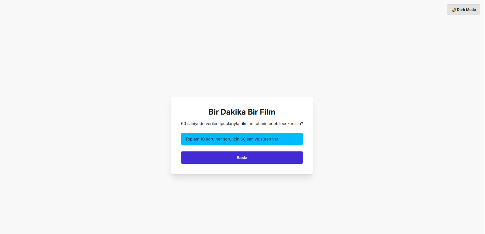
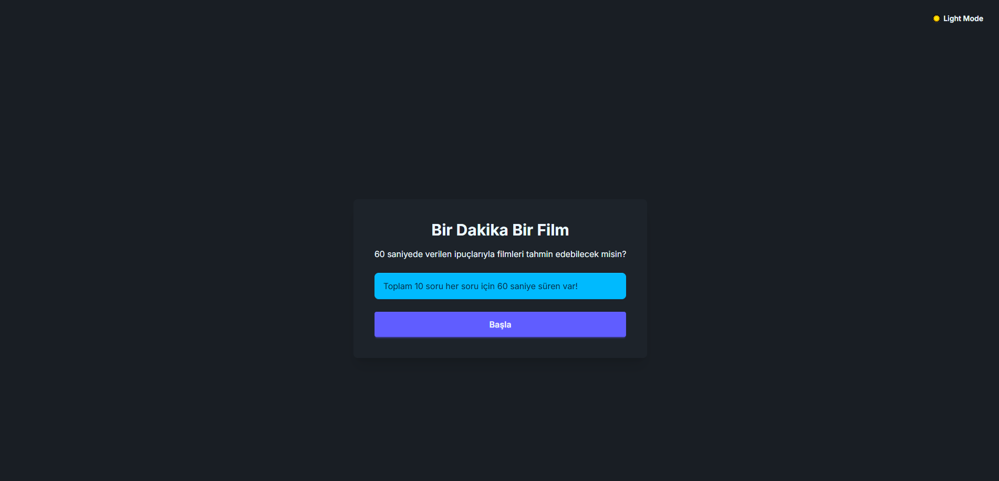

-# 🎬 Bir Dakikada Film Tahmini (Movie Quiz App)


**Bir Dakikada Film Tahmini**, React + Vite ile geliştirilmiş, modern ve kullanıcı dostu bir quiz uygulamasıdır.  
Kullanıcılar, verilen film ipuçlarına göre doğru filmi tahmin etmeye çalışır.  
60 saniye süreli Timer ⏱, ProgressBar 📊, Dark/Light Tema 🌗 desteği ve renkli doğru/yanlış geri bildirimleriyle interaktif bir deneyim sunar.

---

## ✨ Özellikler (Features)

- 🎥 **Film Tahmin Soruları**: Rastgele sıralanan sorular  
- ⏱ **60 Saniye Timer**: Süre bittiğinde otomatik sonraki soruya geçiş  
- 📊 **ProgressBar**: Quiz ilerlemesini gösterir  
- 🌗 **Dark/Light Tema**: DaisyUI ile tema toggle (ve localStorage’da kaydedilir)  
- ✅ **Doğru/Yanlış Geri Bildirim**: Seçilen cevaba göre buton renkleri değişir  
- 📱 **Responsive Tasarım**: Web ve mobil için uyumlu


## 🌍 English Version

Movie Quiz App is a modern and interactive quiz application built with React + Vite.
Players try to guess the correct movie based on a single clue sentence.
Includes 60s timer, progress bar, dark/light theme toggle, and instant correct/wrong feedback.

Features
🎥 Randomized movie questions

⏱ 60 seconds per question (auto skip on timeout)

📊 Progress bar to show quiz progress

🌗 Dark/Light theme toggle (saved in localStorage)

✅ Instant feedback (button colors change for correct/wrong answers)

📱 Responsive design for both desktop and mobile
---

## 📸 Ekran Görüntüleri (Screenshots)

### Light Tema


### Dark Tema


---

## 🚀 Kurulum (Installation)

Projeyi klonlayın ve bağımlılıkları yükleyin:

```bash
git clone https://github.com/kullaniciadi/birdakikada-film-tahmini.git
cd birdakikada-film-tahmini
npm install
Geliştirme sunucusunu başlatın:
npm run dev


Installation
git clone https://github.com/username/movie-quiz-app.git
cd movie-quiz-app
npm install
npm run dev

# API Kullanımı - Bir Dakika Bir Film

Bu proje artık [Open Trivia Database](https://opentdb.com/api.php?amount=10&category=11&type=multiple) API'sinden film soruları çekecek şekilde güncellenmiştir. İşte yapılan değişiklikler ve kullanım:

## 📁 Yeni Dosyalar

### 1. `src/services/api.js`
- Open Trivia Database API çağrıları için ana servis dosyası
- `getQuestions()`, `getQuestion()`, `getQuestionsCount()` fonksiyonları
- Film kategorisinden (category=11) sorular çekiyor

### 2. `src/services/mockApi.js`
- Test için mock API simülasyonu
- Gerçek API olmadığında kullanılır
- 1 saniye gecikme ile API çağrısını simüle eder

### 3. `src/components/LoadingScreen.jsx`
- Veri yüklenirken gösterilen loading ekranı
- Spinner animasyonu ile kullanıcı deneyimi

### 4. `src/components/ErrorScreen.jsx`
- API hatası durumunda gösterilen hata ekranı
- "Tekrar Dene" butonu ile retry özelliği

## 🔄 Yapılan Değişiklikler

### App.jsx
- **Eski:** Statik `questionData` import'u
- **Yeni:** API'den dinamik veri çekme
- Loading ve error state'leri eklendi
- `handleStartQuiz()` ve `handleRetry()` fonksiyonları

### Quiz.jsx
- Değişiklik yok, aynı props ile çalışıyor
- API'den gelen veri formatı aynı

## 🚀 Kullanım

### 1. Open Trivia Database API
```javascript
// src/services/api.js dosyasında
const API_BASE_URL = 'https://opentdb.com/api.php';
const CATEGORY_FILM = 11; // Film kategorisi

// API çağrısı
const response = await fetch(
  `${API_BASE_URL}?amount=${limit}&category=${CATEGORY_FILM}&type=multiple`
);
```

### 2. API Parametreleri
- `amount`: Soru sayısı (1-50 arası)
- `category`: 11 (Film kategorisi)
- `type`: multiple (Çoktan seçmeli)
- `difficulty`: easy, medium, hard (opsiyonel)

### 3. Veri Dönüşümü
API'den gelen veri otomatik olarak projemizin formatına dönüştürülür:
```javascript
// API'den gelen format
{
  question: "Who played Batman in the 1997 film 'Batman and Robin'?",
  correct_answer: "George Clooney",
  incorrect_answers: ["Michael Keaton", "Val Kilmer", "Christian Bale"]
}

// Projemizin formatına dönüştürülür
{
  question: "Who played Batman in the 1997 film 'Batman and Robin'?",
  options: ["George Clooney", "Michael Keaton", "Val Kilmer", "Christian Bale"],
  answer: "George Clooney"
}
```

## 📊 Open Trivia Database API Formatı

API'den gelen ham veri formatı:

```javascript
{
  "response_code": 0,
  "results": [
    {
      "category": "Entertainment: Film",
      "type": "multiple",
      "difficulty": "medium",
      "question": "Who played Batman in the 1997 film 'Batman and Robin'?",
      "correct_answer": "George Clooney",
      "incorrect_answers": ["Michael Keaton", "Val Kilmer", "Christian Bale"]
    }
  ]
}
```

**Response Code'ları:**
- `0`: Başarılı
- `1`: Yetersiz soru (kategori/parametre için)
- `2`: Geçersiz parametre
- `3`: Token bulunamadı
- `4`: Token tükendi

## 🔧 Test Etme

1. `npm run dev` ile projeyi başlatın
2. "Başla" butonuna tıklayın
3. 1 saniye loading ekranı göreceksiniz
4. Sorular yüklenecek ve quiz başlayacak

## ⚠️ Hata Durumları

- **API erişilemez:** ErrorScreen gösterilir
- **Veri formatı yanlış:** Console'da hata mesajı
- **Ağ sorunu:** "Tekrar Dene" butonu ile retry

## 📝 Gelecek Geliştirmeler

- [x] ✅ Open Trivia Database API entegrasyonu
- [ ] Farklı kategoriler (TV, spor, bilim vb.)
- [ ] Zorluk seviyesi filtreleme (easy, medium, hard)
- [ ] Offline cache desteği
- [ ] Progressive loading
- [ ] Error boundary'ler
- [ ] Token sistemi (daha fazla soru için)

## 🎯 Özet

Proje artık [Open Trivia Database](https://opentdb.com/api.php?amount=10&category=11&type=multiple) API'sini kullanarak gerçek film soruları çekiyor. API'den gelen veri otomatik olarak projemizin formatına dönüştürülüyor. Loading ve error state'leri ile kullanıcı deneyimi iyileştirildi. 


